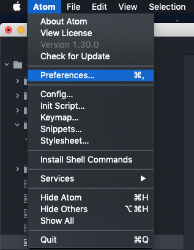
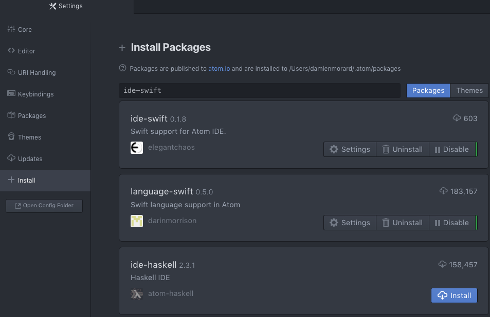

# ATOM

## Comment installer un package sous atom ?

### 1) Cliquer sur *Preferences*

### 2) Cliquer sur *Install* et entrez le nom du package

### Une liste des packages sera alors affichée, cliquer encore sur *Install* et le tour est joué !

### Bonus

- Vous pouvez à tout moment désactiver ou désinstaller les packages dans *Packages*
- Vous pouvez changer le thème de l'interface dans *Themes*

## Un IDE pour swift sur atom: ide-swift

Toutes les explications pour [ide-swift sont ici](https://atom.io/packages/ide-swift).

Il vous faut installer les dépendances suivantes :  
`apm install language-swift-89 atom-ide-ui tool-bar`

Il vous faut aussi installer [SourceKitten](https://github.com/jpsim/SourceKitten).  
Je vous laisse aller voir par vous-même !
