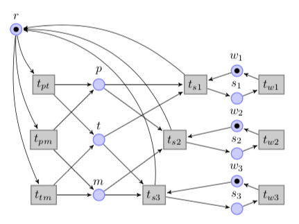

# Modélisation et vérification de logiciel: TP1

---
## Rules

* You must do your homework in your private fork of the course repository.
* You must fill your full name in your GitHub profile.
* If for any reason you have trouble with the deadline,
  contact your teacher as soon as possible.
* The assistants must have access to your source code, but nobody else should have.
* Unless **explicitly** stated, the exercises are personal work. No collaboration, joint work or sharing of code will be tolerated. You can however discuss general approaches with your colleagues.
* Your source code (and tests) must pass all checks of `swift test`
  without warnings or errors.

---

## Homework
* All homeworks are located in the `homework/` directory.
* There will be a specific subfolder for each homework (e.g. `homework/hw1_petrinets`). Use it. Do not rename the folder, place your solutions anywhere else, or do other things.
* do **not rename** any files, variables, functions, classes, ... unless you are instructed to do so!
* read the complete instructions **before** starting an assignment
* follow the instructions given to you in the assignments
* The swift compiler will warn you.
  Make sure you don't see any warnings when you compile your code.
  You can use `swift build` to run it.
* For testing, we use [XCTest](https://developer.apple.com/documentation/xctest).
  It is already installed in your environment,
  and can run all the tests within the test folder files using: `swift test`.

---

## Notation

### Comment êtes-vous évalué ?
- Chaque partie correspond à un certain nombre de points
- Il est nécessaire de passer tous les tests relatifs à une partie pour avoir tous les points (Pensez ```swift test```)
- Si tous les tests ne passent pas, vous aurez seulement une partie des points
- La qualité du code et la documentation sont **IMPORTANTES**. Pour chacun de ces deux points, nous enlèverons - 0.5 point si vous les ignorez.

**PENSEZ BIEN À TOUT LIRE**


## Partie 1 (2 points)

### Les fumeurs de cigarette

Dans cet exerice, nous allons modéliser [le problème des fumeurs de cigarettes](https://en.wikipedia.org/wiki/Cigarette_smokers_problem).  
Ce problème, énoncé par *Suhas Patil*, se présente de la manière suivante:

Pour fabriquer et fumer une cigarette, trois ingrédients sont nécessaires:  
- Du papier à rouler
- Du tabac
- Une allumette

Un certain nombre de fumeurs en chaîne sont assis autour d'une table ronde, disposant chacun d'un ingrédient différent, en quantité infinie.
De plus, un **arbitre** est également assis à la table et dispose quant à lui de tous les ingrédients, en quantités infinies.

L'arbtitre choisit aléatoirement deux des trois ingrédients et les pose sur la table.
Le fumeur disposant de celui manquant saisit alors les ingrédients sur la table
et les utilise pour fabriquer et fumer une cigarette.

L'arbitre ne fait rien dès lors que quelque chose est posé sur la table,
et attend que cette dernière soit à nouveau vide.
Un fumeur ne se saisit pas des ingrédients manquants tant qu'il fume déjà une cigarette.
Ces restrictions mises à part, chaque acteur répète inlassablement son processus respectif.

La figure[1] ci-dessous: représente une possible modélisation du problème des fumeurs de cigarette,
pour 4 fumeurs.

*Figure 1: Problème des fumeurs de cigarette*  



**Encodez le réseau de la figure 1 à l’aide de la libraire PetriKit. Pour cela vous devez compléter
le TODO dans le fichier "SmokersLib.swift".  
Veillez à respecter le nom des places et des transitions.**  
Par exemple, la transition nommée "ts2" doit porter le nom `ts2` dans votre code. Les tests associés à ce travail ne passeront pas si vous ne respectez pas cette consigne!

---

## Partie 2 (2 points)
### Création du graphe de marquage (Reachability graph)


La méthode PTNet.markingGraph(from:) (dans le fichier PTNet+Extensions.swift) est supposée retourner le graphe de marquage d’un réseau Pétri, d’après un marquage initial donné.  
**Écrivez l’implémentation de cette fonction, puis utilisez-la pour générer le graphe de marquage de votre réseau.**  

---

## Partie 3 (2 points)


### Construction du graphe de couverture (Coverability Graph)

Dans cette partie, vous allez écrire l’algorithme de création d’un graphe de marquage.
La méthode PTNet.coverabilityGraph(from:) (dans le fichier PTNet+Extensions.swift) est supposée retourner le graphe de couverture d’un réseau de Pétri, d’après un marquage initial donné.  
**Écrivez l’implémentation de cette fonction.**
